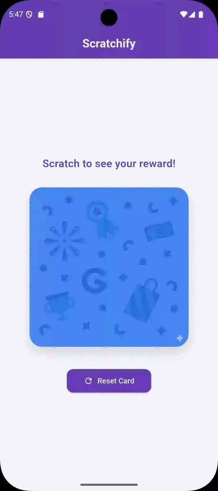

# 🎨 flutter_scratch_card

Scratchify highly customizable scratch card widget for Flutter. Emulate the Google Pay reward system with advanced features like image overlays, multi-level thresholds, haptic feedback, and animated celebrations (Lottie/GIF).

[](https://pub.dev/packages/flutter_scratch_card)
[](https://opensource.org/licenses/MIT)

---

## 📸 Preview


*Example: Image overlay with confetti celebration upon 50% scratch progress.*

---

## ✨ Key Features

- 🖼️ **Advanced Overlays**: Use solid colors, linear/radial gradients, or **asynchronous image assets** (texture patterns).
- 🎨 **Dynamic Layering**: Celebrations (Lottie/GIF) play **on top** of the reward but **under** the scratch layer for a realistic feel.
- 🖌️ **Smooth Brushing**: Adjustable brush size with high-performance stroke drawing.
- 📉 **Precise Tracking**: High-performance grid-based progress detection (even for complex shapes).
- 🎯 **Milestone Triggers**: Trigger celebrations or events at specific progress points (e.g., 20%, 50%, 80%).
- 🎬 **Animated Rewards**: Support for Lottie and GIF animations with automatic lifecycle management.
- 📳 **Haptic Feedback**: Built-in tactile response for a premium user feel.
- ⚡ **Performance First**: Optimized with `RepaintBoundary` and lazy-loaded controllers for 60fps interaction.

---

## 🚀 Installation

Add to your `pubspec.yaml`:

```yaml
dependencies:
  flutter_scratch_card: latest_version
  lottie: ^3.1.2 # Required for Lottie animations
```

---

## 🛠 Usage

### 1. Basic Scratch Card

```dart
ScratchCard(
  brushSize: 30,
  threshold: 0.7, // Fully reveals at 70%
  onThreshold: () => print("Reward Unlocked!"),
  child: Image.asset('assets/reward.png'),
)
```

### 2. Premium Image Overlay with Confetti Milestone

```dart
ScratchCard(
  // Use a metallic texture image for the scratch layer
  overlayImageAsset: 'assets/scratch_texture.png',
  
  // Celebration plays when a milestone is hit
  animationType: ScratchAnimationType.lottie,
  animationAsset: 'assets/confetti.json',
  
  // Wait until 50% is scratched before starting the celebration
  progressTriggers: const [0.5],
  
  autoReveal: true, // Automatically fade out the overlay after threshold
  threshold: 0.6,   // Reveal fully at 60%
  
  child: Center(
    child: Text("₹100 WON", style: TextStyle(fontSize: 32, fontWeight: FontWeight.bold)),
  ),
)
```

---

## ⚙️ Parameters

| Parameter             | Type                     | Default            | Description                                                   |
| --------------------- | ------------------------ | ------------------ | ------------------------------------------------------------- |
| `child`             | `Widget`               | **Required** | The reward/content hidden beneath the scratch layer.          |
| `overlayImageAsset` | `String?`              | `null`           | Asset path for a texture image (e.g., "silver_scratch.png").  |
| `scratchColor`      | `Color`                | `Colors.grey`    | Solid color for the scratch overlay (fallback).               |
| `animationType`     | `ScratchAnimationType` | `none`           | Background celebration type:`none`, `gif`, or `lottie`. |
| `animationAsset`    | `String?`              | `null`           | Path to the animation file.                                   |
| `progressTriggers`  | `List<double>`         | `[]`             | Milestones (0.0 - 1.0) to fire triggers and start animations. |
| `threshold`         | `double`               | `0.5`            | Progress percentage to trigger final full reveal.             |
| `brushSize`         | `double`               | `30.0`           | Size of the scratch diameter.                                 |
| `enableHaptics`     | `bool`                 | `true`           | Whether to trigger vibration during scratching.               |
| `controller`        | `ScratchController?`   | `null`           | Programmatic control for `reveal()` or `reset()`.         |

---

## 🕹 ScratchController

Manage the card state programmatically:

```dart
final controller = ScratchController();

// To reveal the card fully
controller.reveal();

// To reset for a new scratch
controller.reset();

// Current progress
print(controller.progress);
```

---

## 📄 License

This project is licensed under the MIT License - see the [LICENSE](LICENSE) file for details.
